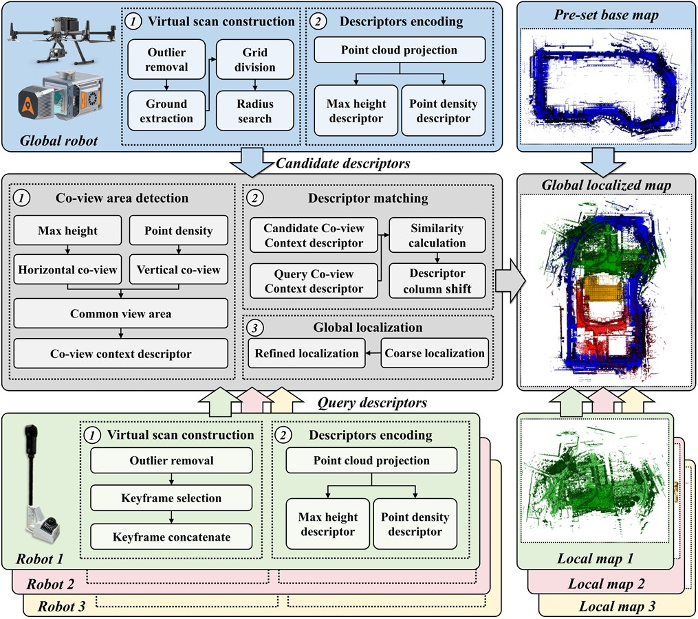
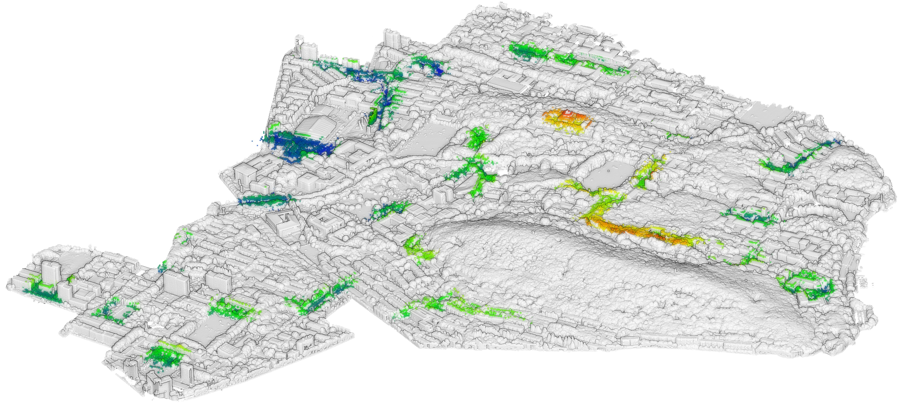
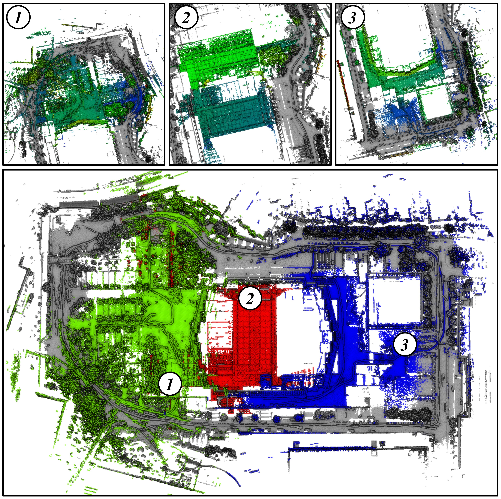

# Co-viewContext
- [Co-viewContext](#Co-viewContext)
  - [Introduction](#Introduction)
  - [How to use](#how-to-use)
    - [1. Pre-requisite](#1-pre-requisite)
    - [2. Compile](#2-compile)
    - [3. Run](#3-Run)
    - [4. Data preparation](#4-data-preparation)
  - [Citation](#Citation)
  - [Acknowledgement](#Acknowledgement)
 
## Introduction
This is the demo code of our work "A Base Map-Guided Global Localization Solution for Heterogeneous Multi-Robot Systems Using a Co-View Context Descriptor".

We propose a base map-guided heterogeneous multi-robots localization solution. In our solution, the global localization of multi-robot systems is accomplished by localizing their local scans in relation to a pre-set base map. A novel Co-view Context descriptor with rotational invariance is developed to represent the characteristics of heterogeneous scans in a unified manner. The pre-set base map is divided into virtual scans, each of which generates a candidate Co-view Context descriptor. These descriptors are assigned to robots before operations to ensure proper functioning in case of communication failures. By matching the query Co-view Context descriptors of a working robot with the assigned candidate descriptors, the coarse localization is achieved. Finally, the refined localization is done through point cloud registration. 



## Demo
### Global localization demo1

### Global localization demo2


## How to use
The code was tested on Ubuntu 18.04
### 1. Pre-requisite
   * [CMake](https://cmake.org/) version 3.10 or above
   * [PCL](https://github.com/PointCloudLibrary/pcl) version 1.8.0 (other versions may also work)
   * [OpenCV](https://opencv.org/) version 3.2.0 (other versions may also work)
   * [Eigen](http://eigen.tuxfamily.org/index.php?title=Main_Page) version 3.3.4 (other versions may also work)
   * [Boost](https://github.com/boostorg/boost) version 1.65 or above
### 2. Compile
Clone this repository and build

```
git clone https://github.com/duanxz0127/Co-viewContext.git
cd Co-viewContext
mkdir build
cd build
cmake ..
make
```

### 3. Run
```
cd ..
sh script/run.sh
```

### 4. Data preparation
You can download our demo dataset at [OneDrive](https://1drv.ms/f/c/fd72da3394f988c8/EmFoo9v1OaBOmsQ2J0aYp1QB0E13C_M5fgOZOPJR7K3hrQ?e=TjTcux) or [BaiduDisk](https://pan.baidu.com/s/1MNGH3aqgT6YaHQ5Xb5jU_Q?pwd=ni48) (Code:ni48).

You can also use your own data and edit the ``reference_scan_path``, ``local_scan_path``, and ``local_scan_pose_path`` in ``run.sh``.


## Citation
To be updated...

## Acknowledgement
We sincerely thank the two open source efforts [ScanContext](https://github.com/gisbi-kim/scancontext_tro?tab=readme-ov-file) and [CSF](https://github.com/jianboqi/CSF) for their contributions to the community.
